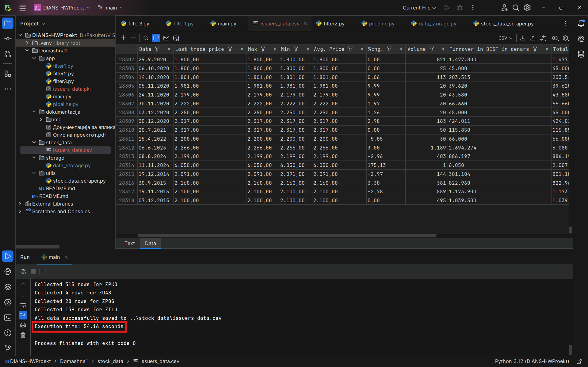

# Домашна 1

Во првата домашна е опфатена Pipe and Filter архитектурата за проток на податоци.
Со користење на оваа архитектура беше потребно да се извлечат податоци за издавачите
на македонската берза.

## Забелешки
### За тестирање на апликацијата, потребно е да се избрише issuers_data.db (претставува sqlite база која го чува датумот на последно ажурирање за секој издавач) која се наоѓа во app фолдерот.

По претходна консултација со професорот, одлучено е редиците кои што имаат Volume 0 да бидат отстранети од структурираната датотека.

max_workers параметарот (кој претставува број на процеси) во функцијата run_pipeline, која се наоѓа во app/pipeline.py може да се прилагоди во зависност од можностите на системот(бројот на јадра на процесорот) на кој ќе се користи апликацијата. При нашето тестирање, најдобро време на извршување добивме со вредност 14 на овој параметар (~50 sec при празна база на податоци).

## Време на извршување
Потребно време за собирање на податоци при празна база од нашиот систем (max_workers=14):

### Визуелизација на извлечените податоци
Некои визуелизации кои се возможни да се направат со извлечените податоци од македонската берза:

