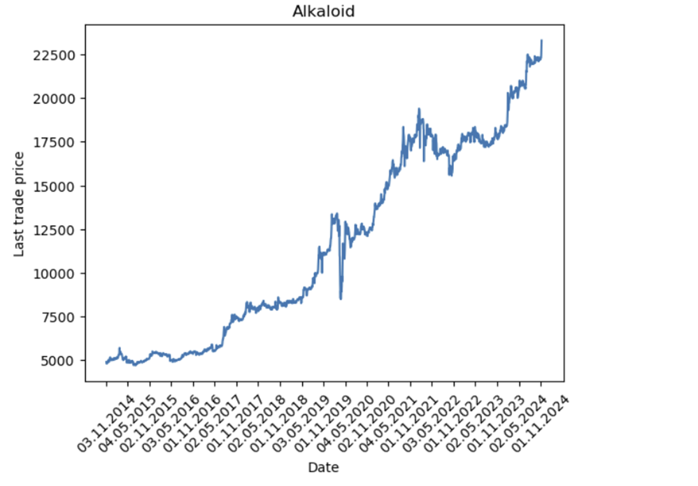
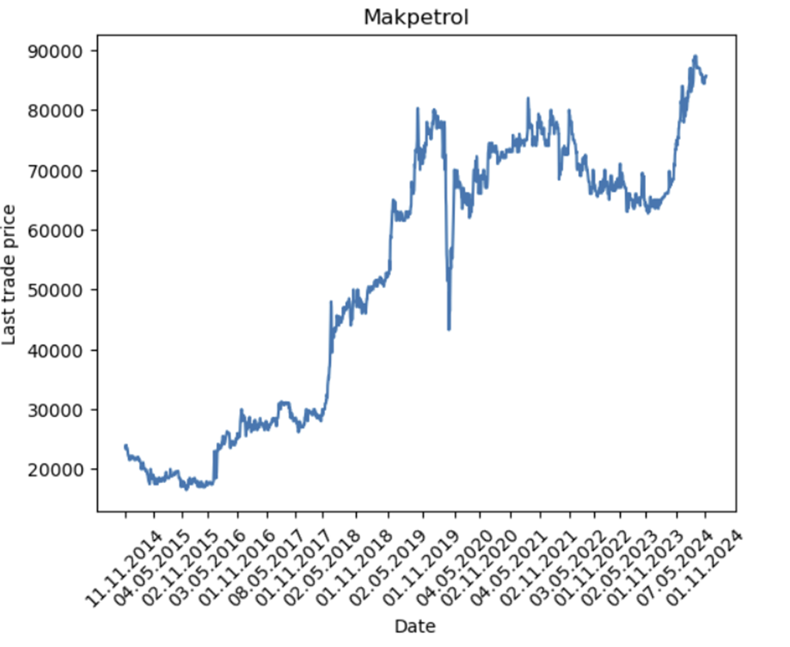

# Домашна 1

Во првата домашна е опфатена Pipe and Filter архитектурата за проток на податоци.
Со користење на оваа архитектура беше потребно да се извлечат податоци за издавачите
на македонската берза.

## Забелешки
### За тестирање на апликацијата, потребно е да се избрише issuers_data.pkl (претставува dict кој го чува датумот на последно ажурирање за секој издавач) кој се наоѓа во filters фолдерот.

По претходна консултација со професорот одлучено е редиците кои што имаат Volume 0 да бидат отстранети од структурираната датотека.

max_workers параметарот (кој претставува број на процеси) во функцијата process_all_issuers, која се наоѓа во filters/main_filter.py може да се прилагоди во зависност од можностите на системот на кој ќе се користи апликацијата. При нашето тестирање, најдобро време на извршување добивме со вредност 8 на овој параметар (~470 sec при празна база на податоци).

  

### Визуелизација на извлечените податоци
Некои визуелизации кои се возможни да се направат со извлечените податоци од македонската берза:

